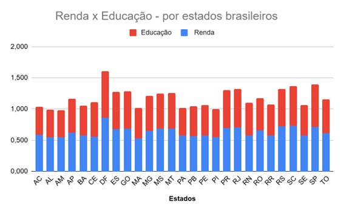
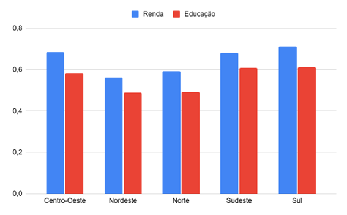

# 📊 Análise de Renda e Educação no Brasil

## 📌 Contexto
Este projeto analisa a relação entre renda e educação nos estados e regiões brasileiras.

## 📊 Dashboard

### 📍 Por Estado
 

### 🌎 Por Região

## 🧠 Principais Insights

### 📈 Relação entre renda e educação
- Observa-se uma **tendência de relação positiva** entre renda e educação  
- Estados com melhores níveis educacionais tendem a apresentar maiores índices de renda  
- Essa relação não é uniforme, indicando a influência de outros fatores socioeconômicos  

---

### 🏆 Destaques por estado
- O Distrito Federal apresenta os maiores índices, configurando-se como um ponto fora da curva  
- Seu desempenho elevado não representa necessariamente o padrão da região Centro-Oeste  
- Estados das regiões Sudeste e Sul concentram, em sua maioria, os melhores resultados  

---

### 🌎 Análise por região
- A região Sul apresenta os **melhores índices médios** de renda e educação  
- O Sudeste aparece em seguida, com desempenho elevado e consistente  
- O Centro-Oeste apresenta bons índices, porém influenciados pelo Distrito Federal  
- As regiões Norte e Nordeste concentram os menores indicadores  

---

### ⚖️ Desigualdades regionais
- Há **disparidades significativas** entre as regiões do país  
- Regiões mais desenvolvidas concentram melhores indicadores socioeconômicos  
- Norte e Nordeste apresentam maior defasagem nos índices analisados  

---

### 📊 Padrões identificados
- Observa-se relativa **homogeneidade dentro das regiões**, com estados apresentando valores próximos entre si  
- A análise regional reforça a existência de padrões estruturais no desenvolvimento do país  

---

## 📌 Insight-chave
A análise evidencia uma associação positiva entre educação e renda no Brasil, marcada por desigualdades regionais e pela influência de outliers como o Distrito Federal, destacando a concentração de melhores indicadores nas regiões Sul e Sudeste.

## 📌 Conclusão
Os resultados evidenciam desigualdades regionais significativas no Brasil, com concentração de melhores indicadores nas regiões Sul e Sudeste.Essa distribuição sugere a influência de fatores estruturais, como maior nível de urbanização, acesso a serviços e desenvolvimento econômico nessas regiões. 
Além disso, observa-se uma associação positiva entre renda e educação, embora não perfeitamente linear, indicando que outros fatores também impactam o desempenho socioeconômico.
Destaca-se ainda a presença de outliers, como o Distrito Federal, cujo elevado desempenho pode distorcer análises regionais quando não avaliado separadamente.
Por fim, os resultados reforçam a importância de análises regionais para compreensão das desigualdades e podem subsidiar discussões sobre políticas públicas voltadas ao desenvolvimento equilibrado entre as regiões.

## 📚 Fonte dos dados
- Base de dados com indicadores de renda e educação de municípios brasileiros  
- 🔗 [Visualizar base de dados (Google Sheets)](https://docs.google.com/spreadsheets/d/1mYWE5gtLrViL5GyhEqhN2mFmgWbsMkha/edit)  
- Dados derivados de bases públicas (ex: IBGE e estudos socioeconômicos)  
- Tratamento e análise realizados no Excel / Google Sheets
- 
## 🛠️ Ferramentas

